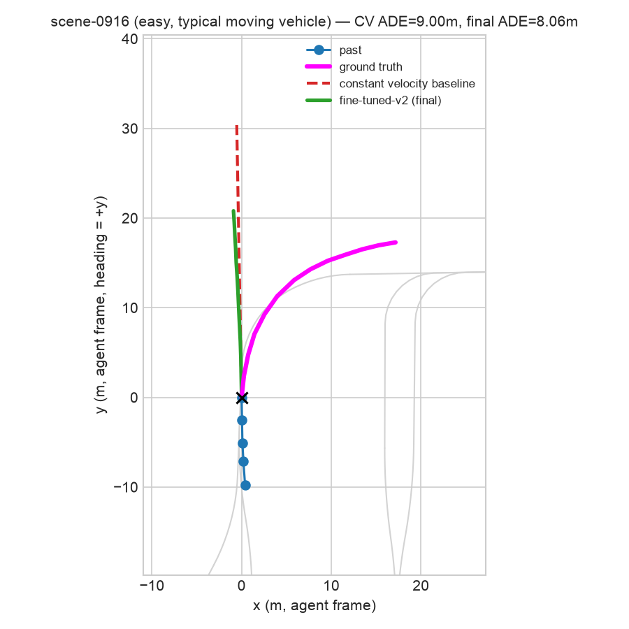
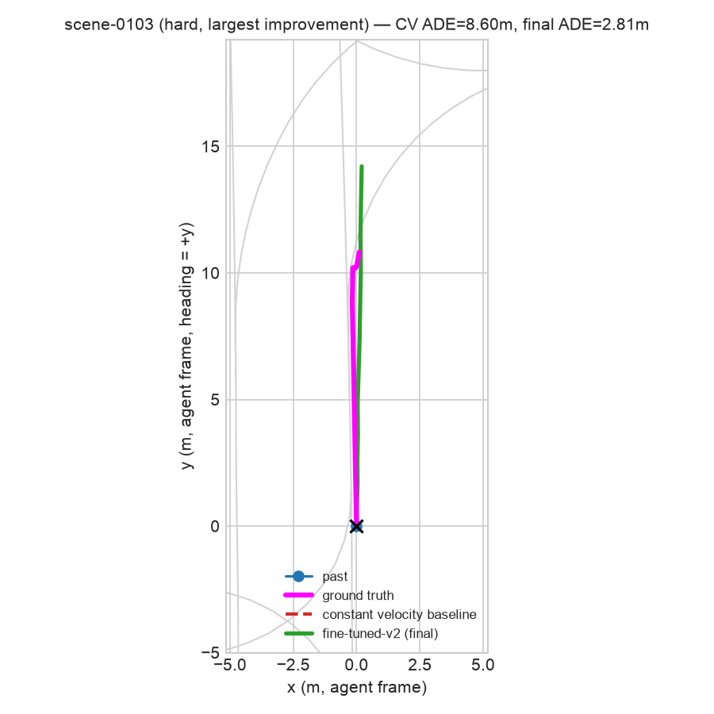
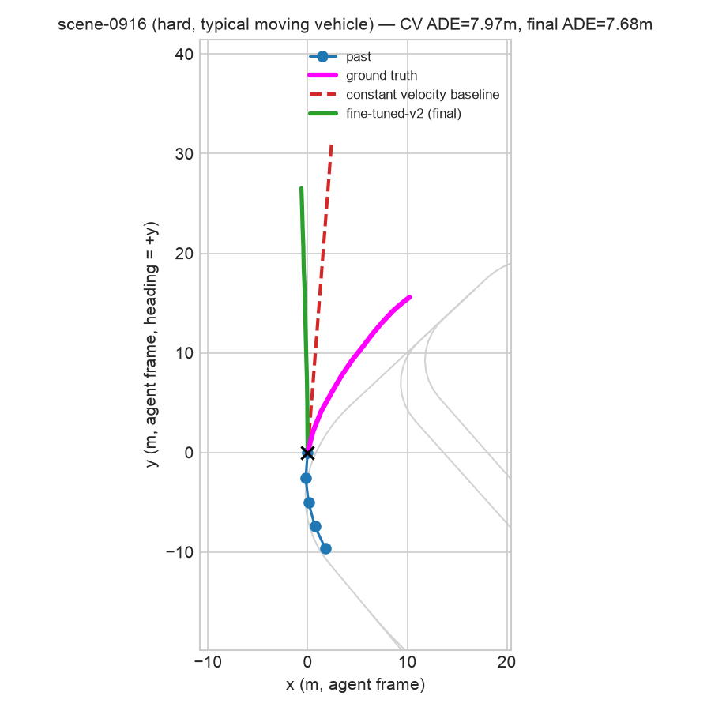

# TrajFlow

A trajectory prediction pipeline for autonomous vehicles, built on nuScenes
**mini**, combining three things in one project:

1. **Classical ML baselines** — constant-velocity and XGBoost models.
2. **A fine-tuned deep learning model** — a compact (108k-parameter)
   trajectory transformer, pretrained on "easy" driving scenes and
   fine-tuned on "hard" ones (dense traffic / intersections).
3. **A human-in-the-loop (HITL) active learning loop** — the model's most
   uncertain predictions are flagged, reviewed and corrected by a human via
   a Streamlit app, and fed back into a second fine-tuning round.

This is a portfolio project for autonomy / planning & prediction engineering
roles. It prioritizes an honestly-measured, end-to-end pipeline over a
state-of-the-art model — every result below is reported as measured,
including the ones where a "smarter" model loses to a one-line baseline.

## Setup

```bash
python3.11 -m venv traj
source traj/bin/activate
pip install -r requirements.txt
```

On macOS, XGBoost additionally requires the OpenMP runtime:

```bash
brew install libomp
```

nuScenes mini requires a free account and a license click-through that
can't be scripted — `python data/download.py` will tell you exactly what
to download and where to put it.

## Pipeline / how to reproduce

Each stage is a standalone script, run in order from the repo root:

```bash
python data/download.py                 # check/extract nuScenes mini + map expansion
python data/preprocess.py                # feature engineering, easy/hard split, train/val/test parquet
python models/baseline_cv.py             # constant-velocity baseline
python models/baseline_xgb.py            # XGBoost baseline
python models/train_pretrain.py          # pretrain transformer on "easy" scenes
python models/finetune.py                # fine-tune on "hard" scenes -> fine-tuned-v1
python hitl/flag_uncertain.py            # flag top ~10% most uncertain hard-train examples
streamlit run hitl/review_app.py         # human review + correction (interactive)
python models/finetune_round2.py         # fine-tune round 2 on HITL-corrected data -> fine-tuned-v2
python viz/scene_overlay.py              # generate the figures below
```

Every script appends to [`results/metrics_comparison.md`](results/metrics_comparison.md)
as it runs, so that file is the single source of truth for every metric in
this README.

## Data

[nuScenes mini](https://www.nuscenes.org/) has 10 scenes (404 samples, 4
maps). Per vehicle instance/sample, `data/preprocess.py` extracts 2s of
past + 6s of future agent-centric trajectory via the devkit's
`PredictHelper`, engineers kinematic + nearest-neighbor features, and
classifies each example as **easy** or **hard** based on neighbor density
and intersection proximity (thresholds tuned against this actual dataset —
see `data/preprocess.py` for why the literature-typical radii didn't
transfer). Of 9,648 candidate examples, 4,715 have a full 6s future and are
kept:

| split | scenes | rows | easy | hard |
|---|---|---|---|---|
| train | 6 | 2,388 | 1,150 | 1,238 |
| val | 2 | 701 | 273 | 428 |
| test | 2 (official `mini_val`, held out untouched) | 1,626 | 747 | 879 |

Splits are scene-level — no scene's samples appear in more than one split.
Full schema in [`data/SCHEMA.md`](data/SCHEMA.md).

**A dataset characteristic worth stating up front**, because it explains a
lot of what follows: the median vehicle in this data moves **0.16m** over
the 6s prediction horizon. Over 90% of examples are effectively parked or
stationary cars. A "predict no movement" baseline is trivially correct
most of the time here — which is exactly what the constant-velocity
baseline does, and why it's a genuinely strong baseline rather than a
strawman.

## Methodology

**Phase 2 — classical baselines.** Constant velocity extrapolates the
final observed velocity linearly. XGBoost (`MultiOutputRegressor` over
`XGBRegressor`) predicts the 24-dim flattened future waypoint vector from
engineered features, trained on the full train split.

**Phase 3 — pretrain.** A compact self-attention encoder over 2s of past
motion, fused with an MLP-encoded context vector (kinematics + 3-nearest-
neighbor features), decoded into K=6 candidate futures + mode
probabilities via a second self-attention block. Trained on the **easy**
split only with a min-of-K displacement + cross-entropy loss (standard
multi-hypothesis trajectory prediction loss). Model-selected by best
val-set minADE.

**Phase 4 — fine-tune (round 1).** Continues from the pretrained
checkpoint, fine-tuned on the **hard** split with a lower LR and fewer
epochs, producing `fine-tuned-v1`.

**Phase 5 — HITL flagging + review.** `hitl/flag_uncertain.py` scores the
hard-scene **training** examples (not test — see the script's docstring:
flagging test examples would mean training on corrected test labels and
then evaluating on those same instances, which would invalidate the
before/after comparison) by combining transformer mode-endpoint spread
with XGBoost/transformer disagreement, and flags the top ~10% (124 of
1,238) for review. `hitl/review_app.py` (Streamlit) shows each flagged
example's past, nearby lane geometry, ground truth, all 6 transformer
modes, and the XGBoost prediction; the reviewer accepts, corrects (via 3
adjustable key waypoints auto-smoothed into the full path, with a live
preview), or tags a failure mode.

**Phase 6 — fine-tune (round 2).** The reviewed corrections are merged
into the hard training set (13 of 1,238 labels actually changed — most
flagged examples were judged fine as-is) and fine-tuning continues from
`fine-tuned-v1`, producing `fine-tuned-v2`.

## Results

Headline comparison, evaluated on the untouched **test** split (all
difficulties):

| Model | minADE (m) | minFDE (m) | Miss Rate @2m |
|---|---|---|---|
| Constant Velocity | **0.511** | **1.101** | **0.077** |
| XGBoost | 1.004 | 2.043 | 0.177 |
| Transformer, pretrained (easy-only) | 0.758 | 1.375 | 0.105 |
| Transformer, fine-tuned-v1 (hard) | 0.925 | 1.776 | 0.082 |
| Transformer, fine-tuned-v2 (post-HITL) | 0.905 | 1.776 | 0.076 |

Full table with val-split rows and easy/hard breakdowns:
[`results/metrics_comparison.md`](results/metrics_comparison.md).

**The honest headline: constant velocity wins in aggregate, and that's a
real finding, not a bug** — but it comes with an important nuance that
changes the story. Given the dataset's overwhelming skew toward
stationary vehicles (above), a physics-based "assume no acceleration"
model is very hard to beat on aggregate metrics dominated by that
majority class:

- **XGBoost is the weakest model.** Two contributing causes, both found
  and fixed/documented during the project: (1) an early version leaked a
  non-rotation-invariant absolute-heading feature that let the tree model
  overfit to specific scenes' road orientations — removing it cut minADE
  from 1.656 to 1.004 — and (2) tree regressors still can't extrapolate
  past the range of displacements seen in training, so they systematically
  underestimate faster-moving agents.
- **The transformer beats XGBoost** even before fine-tuning, and gets
  within reach of constant velocity.
- **Fine-tuning round 1 (hard scenes) made test performance *worse***
  relative to the pretrained checkpoint (minADE 0.758 → 0.925), despite
  improving the validation metric used for model selection. With only 6
  training scenes total, this reads as scene-specific overfitting rather
  than a genuine capability gain — a real risk of fine-tuning on very
  little data, reported as-is rather than hidden.
- **HITL round 2 recovered a modest, genuine slice of that regression**
  (minADE 0.925 → 0.905 on test/all) from correcting only 13 of 1,238
  labels (~1%). A small effect size from a small number of corrections is
  the expected, honest outcome here — not a shortcoming of the approach.

### The moving-vehicle subset flips the story

Constant velocity's aggregate win is almost entirely an artifact of the
dataset's dominant near-stationary majority (median displacement 0.16m —
see above). Restricted to the 63/1,626 test examples where the vehicle
actually moves more than 5m over the 6s horizon — the population that
actually matters for planning — **fine-tuned-v2 beats constant velocity**:

| Model | minADE (m), moving vehicles only | minFDE (m) | Miss Rate @2m |
|---|---|---|---|
| Constant Velocity | 6.604 | 15.591 | 0.952 |
| Transformer, fine-tuned-v2 | **5.434** | **12.870** | **0.873** |

This holds up whether you look at easy or hard moving vehicles
separately (fine-tuned-v2 wins both), and whether you look at the mean
(5.43m vs 6.60m) or a straight win-count (fine-tuned-v2 has lower
per-example error in 38 of 63 cases, 60%). The takeaway: the aggregate
metric is honest but easy to over-read — "constant velocity wins" really
means "constant velocity wins on parked cars," and the learned model is
the better predictor once a vehicle is actually doing something
interesting. Logged as its own rows in
[`results/metrics_comparison.md`](results/metrics_comparison.md)
(phase 7, difficulty=`moving (>5m displacement)`), generated by
`viz/scene_overlay.py`.

### Figures

**Easy scene, typical moving vehicle** (selected by median *relative*
performance among moving vehicles, not median absolute error — see script
comments for why that distinction matters) — fine-tuned-v2 tracks the
curve into the ground truth noticeably better than constant velocity's
straight-line overshoot (ADE 8.06m vs 9.00m).



**Hard scene, largest improvement over the baseline** — this vehicle had
zero recent velocity (just pulling away from a stop). Constant velocity
predicts it stays exactly stationary for the full 6s; it actually
accelerates forward ~11m. The fine-tuned model correctly anticipates the
acceleration (ADE 2.81m vs 8.60m). This is the kind of case fine-tuning
is *supposed* to help with, and here it clearly does.



**Hard scene, typical moving vehicle** — a representative case from the
moving-vehicle subset above, not a cherry-pick: the vehicle curves
through a turn, constant velocity overshoots the curve's sharpness, and
the fine-tuned model tracks it slightly better (ADE 7.68m vs 7.97m) — a
close, unremarkable case, which is the point: on genuinely moving
vehicles the two models are much closer than the aggregate table
suggests, with fine-tuned-v2 slightly ahead on average.



## Human-in-the-loop review, in practice

124 examples were reviewed: 111 accepted as-is, 13 corrected. Failure-mode
tags: 112 none, 9 sensor noise, 3 occlusion (no aggressive-merge or
map-ambiguity tags landed in this pass). The low correction rate is itself
informative — most flagged "uncertain" examples turned out to have
perfectly good ground truth; the model was uncertain because the *task*
was hard (new instance with no observed history, an ambiguous intersection
turn), not because the *label* was wrong. Distinguishing those two things
is the actual point of a human review step: a model disagreeing with
itself doesn't mean the data is broken.

## Limitations & what I'd do with more compute/data

- **nuScenes mini is tiny (10 scenes).** Train/val/test come from disjoint
  individual scenes, so scene-to-scene variance dominates — e.g. the
  constant-velocity baseline's own minADE is 2.17 on train, 2.49 on val,
  and 0.51 on test, purely because those scenes happen to have very
  different typical vehicle speeds. Any single-run result here should be
  read as "plausible given this data," not "precisely measured" — the
  fix is the full nuScenes (or Waymo/Argoverse2) dataset with proper
  cross-validation across many more scenes.
- **The dataset is dominated by near-stationary vehicles**, which is why
  constant velocity is such a strong baseline. A production system would
  want metrics stratified by (or a training/eval set rebalanced toward)
  genuinely moving agents, since that's where prediction quality actually
  matters for planning.
- **Fine-tuning on 6 scenes is overfitting-prone**, as shown by round 1's
  test regression. More scenes, stronger regularization, or early stopping
  keyed to a larger/more representative validation set would help.
- **The transformer only sees 3 nearest neighbors and no map-vector
  encoding** (map context is used for the easy/hard split and the HITL
  viewer, not as a model input). A production model would encode the full
  local lane graph (e.g. VectorNet/LaneGCN-style) rather than scalar
  nearest-neighbor features.
- **HITL correction volume was small by construction** (10% flag rate,
  124 examples, 13 real corrections) — enough to demonstrate the full
  loop honestly, not enough to expect a dramatic before/after swing. At
  production scale, this loop would run continuously over much larger
  flagged batches.
- Two infrastructure issues were found and fixed along the way, documented
  in code comments and commit messages: a non-rotation-invariant feature
  leak (see XGBoost note above), and a macOS-specific OpenMP conflict
  between PyTorch and XGBoost that segfaults/deadlocks unless
  `KMP_DUPLICATE_LIB_OK`/`OMP_NUM_THREADS` are set before either library
  is imported.

## Repo layout

See [`CLAUDE.md`](CLAUDE.md) for the full build spec, phase breakdown, and
acceptance criteria driving this project.

```
data/            download + preprocessing, schema doc
models/          baselines, transformer architecture, pretrain/fine-tune scripts
evaluation/      metrics (minADE/minFDE/MissRate) + comparison-table logging
hitl/            uncertainty flagging + Streamlit review app
viz/             scene overlay figure generation
results/         metrics_comparison.md + figures/
corrections/     HITL reviewer output (gitignored — personal review data)
```
