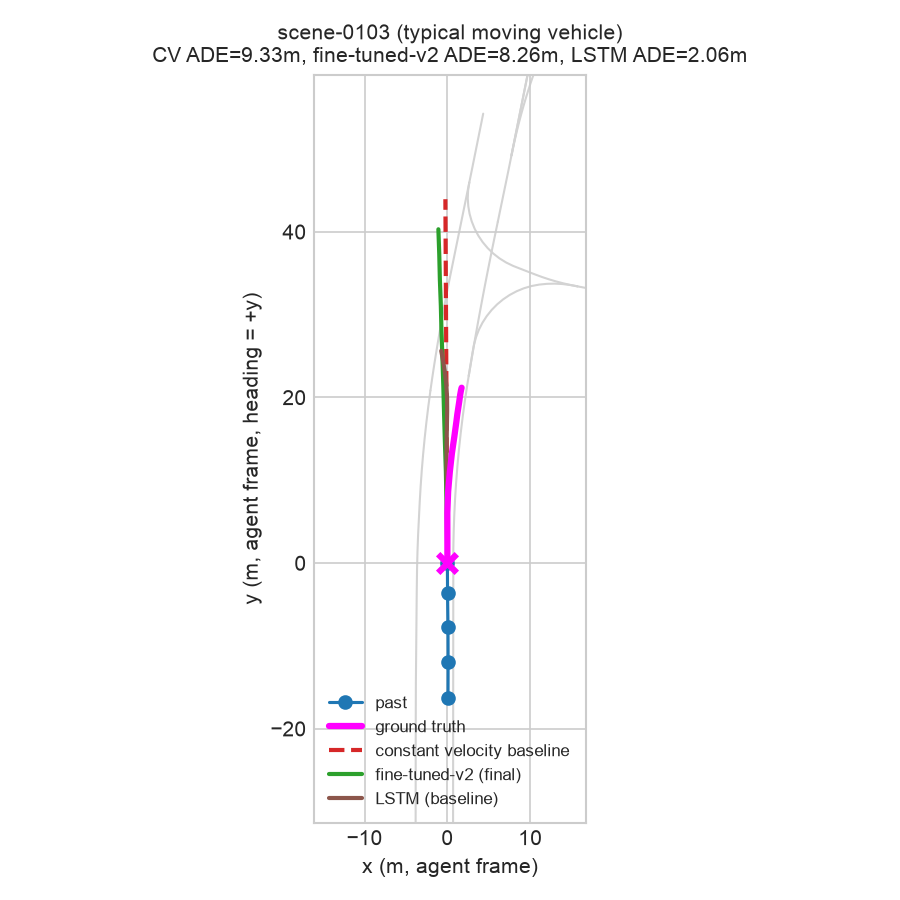

# TrajFlow

A trajectory prediction pipeline for autonomous vehicles, built on nuScenes
**mini**, combining three things in one project:

1. **Classical ML baselines** — constant-velocity, constant-acceleration,
   and XGBoost models.
2. **Two deep learning architectures** — a compact (108k-parameter)
   trajectory transformer, pretrained on "easy" driving scenes and
   fine-tuned on "hard" ones (dense traffic / intersections); and a
   compact (41k-parameter) LSTM encoder-decoder trained on the full
   dataset as an architecture comparison point.
3. **A human-in-the-loop (HITL) active learning loop** — the transformer's
   most uncertain predictions are flagged, reviewed and corrected by a
   human via a Streamlit app, and fed back into a second fine-tuning round.

This is a portfolio project for autonomy / planning & prediction engineering
roles. It prioritizes an honestly-measured, end-to-end pipeline over a
state-of-the-art model — every result below is reported as measured,
including the ones where a "smarter" model loses to a one-line baseline.

## Setup

TrajFlow is a real installable package (`src/trajflow/`, PEP 621
`pyproject.toml`) — clone it, create a virtualenv, and install it editable:

```bash
python3.11 -m venv traj
source traj/bin/activate
pip install -e .
```

That single `pip install -e .` pulls in every pinned dependency (torch,
nuscenes-devkit, xgboost, streamlit, etc. — see `pyproject.toml`) and
registers a `trajflow-*` console command for every pipeline stage below, so
nothing needs to be run with `python path/to/script.py` or manual
`PYTHONPATH`/`sys.path` hacks.

On macOS, XGBoost additionally requires the OpenMP runtime:

```bash
brew install libomp
```

nuScenes mini requires a free account and a license click-through that
can't be scripted — `trajflow-download` will tell you exactly what to
download and where to put it.

## Pipeline / how to reproduce

Every stage is a `trajflow-*` console command (installed by `pip install
-e .` above), run in order from the repo root:

```bash
trajflow-download                 # check/extract nuScenes mini + map expansion
trajflow-preprocess                # feature engineering, easy/hard split, train/val/test parquet
trajflow-baseline-cv               # constant-velocity baseline
trajflow-baseline-ca               # constant-acceleration baseline
trajflow-baseline-xgb              # XGBoost baseline
trajflow-pretrain                  # pretrain transformer on "easy" scenes
trajflow-finetune                  # fine-tune on "hard" scenes -> fine-tuned-v1
trajflow-flag-uncertain            # flag top ~10% most uncertain hard-train examples
trajflow-review-app                # human review + correction (interactive, Streamlit)
trajflow-finetune-round2           # fine-tune round 2 on HITL-corrected data -> fine-tuned-v2
trajflow-train-lstm                # train the LSTM comparison architecture (full train split)
trajflow-train-transformer-full    # controlled experiment: transformer, same full-split training as the LSTM
trajflow-scene-overlay             # generate the figures below
trajflow-moving-subset-analysis    # log every model's performance on genuinely moving vehicles
trajflow-dashboard                 # interactive results dashboard (see below)
```

Every script appends to [`results/metrics_comparison.md`](results/metrics_comparison.md)
as it runs, so that file is the single source of truth for every metric in
this README.

**One-command run:** [`scripts/run_pipeline.sh`](scripts/run_pipeline.sh) runs
every non-interactive stage above in order and pauses right before the HITL
review step; run it again with `--resume-after-hitl` after completing a
review pass to fine-tune round 2 and regenerate the figures.

```bash
./scripts/run_pipeline.sh
# ... complete a review pass in the app it points you to ...
./scripts/run_pipeline.sh --resume-after-hitl
```

Data, checkpoints, and results all live at the repo root next to `src/`
(`data/`, `checkpoints/`, `artifacts/`, `corrections/`, `results/`) rather
than inside the package, so they persist across reinstalls — see
`src/trajflow/paths.py` for the exact layout.

### Results dashboard

`trajflow-dashboard` — a read-only companion to the HITL review app (no
correction controls, just exploration):

- **Metrics tab**: filter `results/metrics_comparison.md` by eval split /
  difficulty, a bar chart per metric, and the full sortable table with
  each row's methodology notes.
- **Scene Browser tab**: pick any test example (with an easy/hard filter
  and a "moving vehicles only" filter — see below) and see history,
  ground truth, and *every* model's prediction (constant velocity,
  constant acceleration, XGBoost, all three transformer checkpoints, and
  the LSTM) overlaid on the map, with a per-example error table
  underneath.

## Data

[nuScenes mini](https://www.nuscenes.org/) has 10 scenes (404 samples, 4
maps). Per vehicle instance/sample, `src/trajflow/data/preprocess.py` extracts 2s of
past + 6s of future agent-centric trajectory via the devkit's
`PredictHelper`, engineers kinematic + nearest-neighbor features, and
classifies each example as **easy** or **hard** based on neighbor density
and intersection proximity (thresholds tuned against this actual dataset —
see `src/trajflow/data/preprocess.py` for why the literature-typical radii didn't
transfer). Of 9,648 candidate examples, 4,715 have a full 6s future and are
kept:

| split | scenes | rows | easy | hard |
|---|---|---|---|---|
| train | 6 | 2,388 | 1,150 | 1,238 |
| val | 2 | 701 | 273 | 428 |
| test | 2 (official `mini_val`, held out untouched) | 1,626 | 747 | 879 |

Splits are scene-level — no scene's samples appear in more than one split.
Full schema in [`data/SCHEMA.md`](data/SCHEMA.md).

**A dataset characteristic worth stating up front**, because it explains a
lot of what follows: the median vehicle in this data moves **0.16m** over
the 6s prediction horizon. Over 90% of examples are effectively parked or
stationary cars. A "predict no movement" baseline is trivially correct
most of the time here — which is exactly what the constant-velocity
baseline does, and why it's a genuinely strong baseline rather than a
strawman.

## Methodology

**Phase 2 — classical baselines.** Constant velocity extrapolates the
final observed velocity linearly. Constant acceleration extends this with
an acceleration vector estimated from a double finite-difference of the
two most recent past positions, then extrapolates `pos(t) = v*t +
0.5*a*t^2` — added in a later pass to broaden the classical comparison.
XGBoost (`MultiOutputRegressor` over `XGBRegressor`) predicts the 24-dim
flattened future waypoint vector from engineered features, trained on the
full train split.

**An LSTM comparison architecture** (`src/trajflow/models/lstm.py`, also added in a
later pass): an LSTM encodes 2s of past motion, fused with the same
context vector the transformer uses, and decodes K=6 candidate futures
autoregressively (one `LSTMCell` step per future timestep, feeding each
predicted position delta back in as the next input) rather than the
transformer's parallel attention-based decoding. Trained on the **full**
train split (both easy and hard, one training run) — unlike the
transformer's pretrain/fine-tune/HITL-fine-tune lineage below, this model
is a standalone architecture-comparison point, not part of that pipeline.
Same `TrajectoryDataset` and min-of-K + cross-entropy loss as the
transformer, so the comparison isn't confounded by different data
representations or loss functions — training regime (full-split single
run vs. pretrain/fine-tune) is a separate confound, addressed directly by
`src/trajflow/models/train_transformer_full.py` (same architecture as the pretrained/
fine-tuned lineage, trained the LSTM's way) — see Results.

**Phase 3 — pretrain.** A compact self-attention encoder over 2s of past
motion, fused with an MLP-encoded context vector (kinematics + 3-nearest-
neighbor features), decoded into K=6 candidate futures + mode
probabilities via a second self-attention block. Trained on the **easy**
split only with a min-of-K displacement + cross-entropy loss (standard
multi-hypothesis trajectory prediction loss). Model-selected by best
val-set minADE.

**Phase 4 — fine-tune (round 1).** Continues from the pretrained
checkpoint, fine-tuned on the **hard** split with a lower LR and fewer
epochs, producing `fine-tuned-v1`.

**Phase 5 — HITL flagging + review.** `src/trajflow/hitl/flag_uncertain.py` scores the
hard-scene **training** examples (not test — see the script's docstring:
flagging test examples would mean training on corrected test labels and
then evaluating on those same instances, which would invalidate the
before/after comparison) by combining transformer mode-endpoint spread
with XGBoost/transformer disagreement, and flags the top ~10% (124 of
1,238) for review. `src/trajflow/hitl/review_app.py` (Streamlit) shows each flagged
example's past, nearby lane geometry, ground truth, all 6 transformer
modes, and the XGBoost prediction; the reviewer accepts, corrects (via 3
adjustable key waypoints auto-smoothed into the full path, with a live
preview), or tags a failure mode.

**Phase 6 — fine-tune (round 2).** The reviewed corrections are merged
into the hard training set (13 of 1,238 labels actually changed — most
flagged examples were judged fine as-is) and fine-tuning continues from
`fine-tuned-v1`, producing `fine-tuned-v2`.

## Results

Headline comparison, evaluated on the untouched **test** split (all
difficulties):

| Model | minADE (m) | minFDE (m) | Miss Rate @2m |
|---|---|---|---|
| Constant Velocity | 0.511 | 1.101 | 0.077 |
| Constant Acceleration | 1.093 | 2.699 | 0.231 |
| XGBoost | 1.004 | 2.043 | 0.177 |
| Transformer, pretrained (easy-only) | 0.758 | 1.375 | 0.105 |
| Transformer, fine-tuned-v1 (hard) | 0.925 | 1.776 | 0.082 |
| Transformer, fine-tuned-v2 (post-HITL) | 0.905 | 1.776 | 0.076 |
| **LSTM (baseline)** | **0.267** | **0.521** | **0.051** |

Full table with val-split rows and easy/hard breakdowns:
[`results/metrics_comparison.md`](results/metrics_comparison.md).

**The honest headline has changed since the LSTM was added: it's now the
best model on every metric, by a wide margin** — and that result comes
with an important caveat about what's actually being compared (see
below). Before that:

- **Constant acceleration substantially underperforms constant velocity**
  (minADE 1.093 vs 0.511), despite being the more sophisticated physics
  model. Acceleration estimated from a double finite-difference of noisy
  position data is itself noisy, and the `t^2` term in constant-
  acceleration kinematics amplifies that noise over the 6s horizon — a
  small spurious acceleration estimate produces a >100m overshoot by t=6s
  for an otherwise near-stationary vehicle. A textbook fragility of naive
  higher-order kinematic extrapolation, not a bug (verified on specific
  examples — see `src/trajflow/models/baseline_ca.py`).
- **XGBoost is the weakest learned model.** Two contributing causes, both
  found and fixed/documented during the project: (1) an early version
  leaked a non-rotation-invariant absolute-heading feature that let the
  tree model overfit to specific scenes' road orientations — removing it
  cut minADE from 1.656 to 1.004 — and (2) tree regressors still can't
  extrapolate past the range of displacements seen in training, so they
  systematically underestimate faster-moving agents.
- **The transformer beats XGBoost** even before fine-tuning, and gets
  within reach of constant velocity.
- **Fine-tuning round 1 (hard scenes) made test performance *worse***
  relative to the pretrained checkpoint (minADE 0.758 → 0.925), despite
  improving the validation metric used for model selection. With only 6
  training scenes total, this reads as scene-specific overfitting rather
  than a genuine capability gain — a real risk of fine-tuning on very
  little data, reported as-is rather than hidden.
- **HITL round 2 recovered a modest, genuine slice of that regression**
  (minADE 0.925 → 0.905 on test/all) from correcting only 13 of 1,238
  labels (~1%). A small effect size from a small number of corrections is
  the expected, honest outcome here — not a shortcoming of the approach.

**About that LSTM result — I ran the controlled experiment, and it
mostly held up.** The LSTM is trained differently from the transformer:
one training run on the *full* train split, vs. the transformer's
pretrain-on-easy → fine-tune-on-hard → fine-tune-again-on-HITL-
corrections lineage. That's two confounded variables — architecture and
training regime — so `src/trajflow/models/train_transformer_full.py` trains the exact
same `TrajectoryTransformer` architecture the same way the LSTM is
trained (full train split, one pass, identical loss/epochs/batch size)
to isolate the two:

| Model | minADE (m), test/all | minADE (m), moving vehicles only |
|---|---|---|
| Transformer, pretrained (fragmented pipeline) | 0.758 | 5.791 |
| **Transformer, full-split (controlled)** | **0.750** | **4.477** |
| LSTM (baseline) | 0.267 | 2.738 |

Training regime turned out to matter *less* than my original guess:
giving the transformer the same full-split training as the LSTM barely
moved the aggregate number (0.758 → 0.750) and only partially closed the
moving-vehicle gap (5.791 → 4.477, still nearly double the LSTM's 2.738).
**Architecture accounts for most of the remaining gap** — the LSTM's
recurrent, autoregressive decoder (one step conditions on the last)
appears to have a real, substantial edge over the transformer's parallel
attention-based decoding for this task, independent of how the data is
split across training stages. That's a genuine, if narrow and single-
dataset, finding rather than an artifact of an unfair comparison — logged
as its own model (`Transformer (full-split)`) in
[`results/metrics_comparison.md`](results/metrics_comparison.md) so the
before/after is auditable.

### The moving-vehicle subset

Constant velocity's aggregate win is almost entirely an artifact of the
dataset's dominant near-stationary majority (median displacement 0.16m —
see above). Restricted to the 63/1,626 test examples where the vehicle
actually moves more than 5m over the 6s horizon — the population that
actually matters for planning — several learned models beat constant
velocity, and the LSTM's lead widens further:

| Model | minADE (m), moving vehicles only | minFDE (m) | Miss Rate @2m |
|---|---|---|---|
| Constant Velocity | 6.604 | 15.591 | 0.952 |
| Constant Acceleration | 6.853 | 16.744 | 0.937 |
| XGBoost | 5.390 | 13.174 | 0.984 |
| Transformer, pretrained | 5.791 | 13.383 | 0.921 |
| Transformer, fine-tuned-v1 | 5.493 | 12.898 | 0.889 |
| Transformer, fine-tuned-v2 | 5.434 | 12.870 | 0.873 |
| Transformer, full-split (controlled) | 4.477 | 10.456 | 0.873 |
| **LSTM (baseline)** | **2.738** | **6.391** | 0.921 |

Ranked by minADE, the LSTM's lead over the second-best model (XGBoost,
5.390) is larger on this subset than in aggregate — it isn't just winning
by being confidently correct on parked cars. More generally: every
learned model except constant acceleration beats constant velocity here.
The takeaway is the same as before, just sharper — the aggregate metric
is honest but easy to over-read; "constant velocity wins" really means
"constant velocity wins on parked cars," and several learned models are
better predictors once a vehicle is actually doing something interesting.
Logged as its own rows in
[`results/metrics_comparison.md`](results/metrics_comparison.md)
(phase 7, difficulty=`moving (>5m displacement)`), generated by
`src/trajflow/evaluation/moving_subset_analysis.py` for every registered model.

### Figures

**Easy scene, typical moving vehicle** (selected by median *relative*
performance among moving vehicles, not median absolute error — see script
comments for why that distinction matters) — fine-tuned-v2 tracks the
curve into the ground truth noticeably better than constant velocity's
straight-line overshoot (ADE 8.06m vs 9.00m).


**Hard scene, largest improvement over the baseline** — this vehicle had
zero recent velocity (just pulling away from a stop). Constant velocity
predicts it stays exactly stationary for the full 6s; it actually
accelerates forward ~11m. The fine-tuned model correctly anticipates the
acceleration (ADE 2.81m vs 8.60m). This is the kind of case fine-tuning
is *supposed* to help with, and here it clearly does.


**Hard scene, typical moving vehicle** — a representative case from the
moving-vehicle subset above, not a cherry-pick: the vehicle curves
through a turn, constant velocity overshoots the curve's sharpness, and
the fine-tuned model tracks it slightly better (ADE 7.68m vs 7.97m) — a
close, unremarkable case, which is the point: on genuinely moving
vehicles the two models are much closer than the aggregate table
suggests, with fine-tuned-v2 slightly ahead on average.


**Typical moving vehicle, with the LSTM added** — a *median*, not
cherry-picked, moving-vehicle example (see caveat above about training-
regime confound). Constant velocity and fine-tuned-v2 both roughly
extrapolate a straight line, overshooting the vehicle's actual turn;
the LSTM tracks the curve closely (ADE 2.06m vs 9.33m and 8.26m).



## Human-in-the-loop review, in practice

124 examples were reviewed: 111 accepted as-is, 13 corrected. Failure-mode
tags: 112 none, 9 sensor noise, 3 occlusion (no aggressive-merge or
map-ambiguity tags landed in this pass). The low correction rate is itself
informative — most flagged "uncertain" examples turned out to have
perfectly good ground truth; the model was uncertain because the *task*
was hard (new instance with no observed history, an ambiguous intersection
turn), not because the *label* was wrong. Distinguishing those two things
is the actual point of a human review step: a model disagreeing with
itself doesn't mean the data is broken.

## Limitations & what I'd do with more compute/data

- **nuScenes mini is tiny (10 scenes).** Train/val/test come from disjoint
  individual scenes, so scene-to-scene variance dominates — e.g. the
  constant-velocity baseline's own minADE is 2.17 on train, 2.49 on val,
  and 0.51 on test, purely because those scenes happen to have very
  different typical vehicle speeds. Any single-run result here should be
  read as "plausible given this data," not "precisely measured" — the
  fix is the full nuScenes (or Waymo/Argoverse2) dataset with proper
  cross-validation across many more scenes.
- **The dataset is dominated by near-stationary vehicles**, which is why
  constant velocity is such a strong baseline. A production system would
  want metrics stratified by (or a training/eval set rebalanced toward)
  genuinely moving agents, since that's where prediction quality actually
  matters for planning.
- **Fine-tuning on 6 scenes is overfitting-prone**, as shown by round 1's
  test regression. More scenes, stronger regularization, or early stopping
  keyed to a larger/more representative validation set would help.
- **The controlled LSTM-vs-transformer experiment (see Results) only
  isolates one factor.** `src/trajflow/models/train_transformer_full.py` confirmed
  architecture, not training regime, explains most of the gap — but that
  experiment held the architecture's own hyperparameters fixed (d_model,
  layer count, etc., never tuned in this project for either model). A
  fuller ablation would also vary the LSTM's hidden size and the
  transformer's depth/width to check the gap isn't just "the LSTM
  happened to get a better parameter count for this data size."
  Also worth running the reverse direction: putting the LSTM through the
  same pretrain/fine-tune/HITL pipeline, to see if it's similarly
  overfitting-prone on small fragmented slices.
- **The transformer only sees 3 nearest neighbors and no map-vector
  encoding** (map context is used for the easy/hard split and the HITL
  viewer, not as a model input). A production model would encode the full
  local lane graph (e.g. VectorNet/LaneGCN-style) rather than scalar
  nearest-neighbor features.
- **HITL correction volume was small by construction** (10% flag rate,
  124 examples, 13 real corrections) — enough to demonstrate the full
  loop honestly, not enough to expect a dramatic before/after swing. At
  production scale, this loop would run continuously over much larger
  flagged batches.
- Two infrastructure issues were found and fixed along the way, documented
  in code comments and commit messages: a non-rotation-invariant feature
  leak (see XGBoost note above), and a macOS-specific OpenMP conflict
  between PyTorch and XGBoost that segfaults/deadlocks unless
  `KMP_DUPLICATE_LIB_OK`/`OMP_NUM_THREADS` are set before either library
  is imported.

## Repo layout

See [`CLAUDE.md`](CLAUDE.md) for the full build spec, phase breakdown, and
acceptance criteria driving this project. (The original spec put every
module at the repo root; it was later reorganized into an installable
`src/` package — see "Setup" above — for a one-command, `pip install
-e .` reproducible install. The phase plan and acceptance criteria are
unchanged.)

```
pyproject.toml           dependencies + trajflow-* console-script entry points
scripts/run_pipeline.sh  one-command runner for the whole non-interactive pipeline

src/trajflow/
  data/          download + preprocessing, schema doc
  models/        baselines (CV, CA, XGBoost), transformer + LSTM architectures,
                 pretrain/fine-tune scripts
  evaluation/    metrics (minADE/minFDE/MissRate), comparison-table logging,
                 moving-vehicle-subset analysis
  hitl/          uncertainty flagging + Streamlit review app
  viz/           model registry (shared prediction interface for all 7 models),
                 scene overlay figure generation, interactive results dashboard
  paths.py       single source of truth for every data/artifact directory below

data/            nuScenes mini (gitignored) + processed/ parquet (gitignored) + SCHEMA.md
checkpoints/     trained model weights (gitignored — regenerable)
artifacts/       HITL flagging output, e.g. flagged.parquet (gitignored)
corrections/     HITL reviewer output (gitignored — personal review data)
results/         metrics_comparison.md + figures/
```
