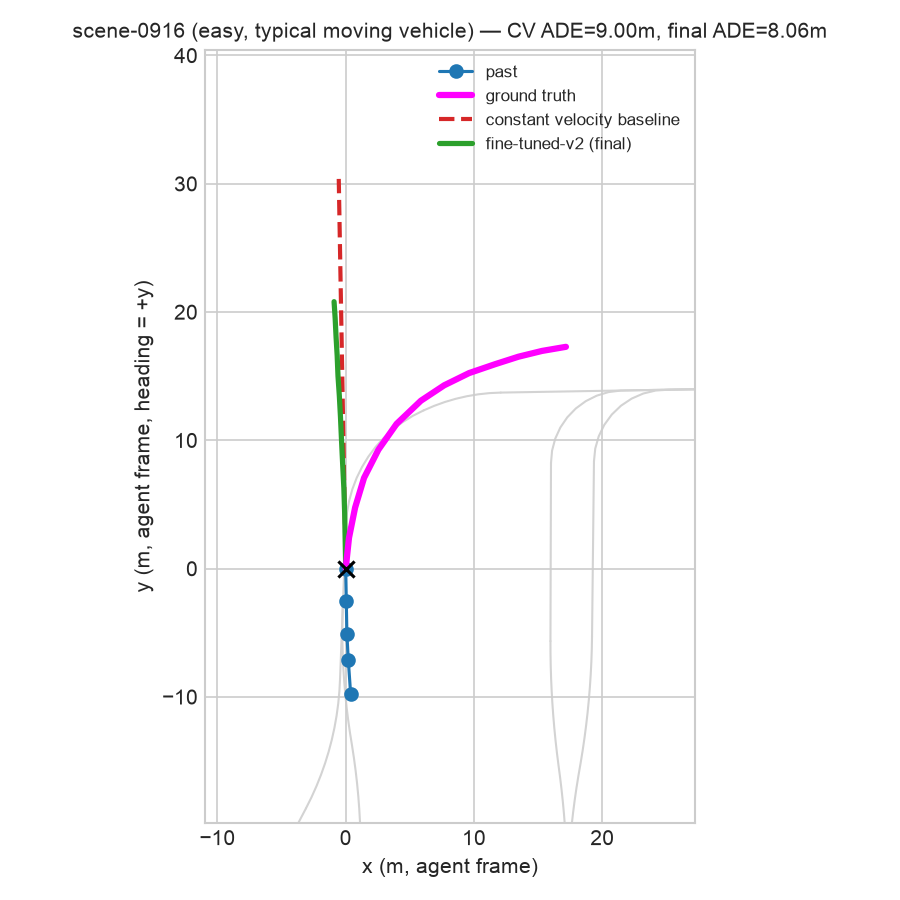
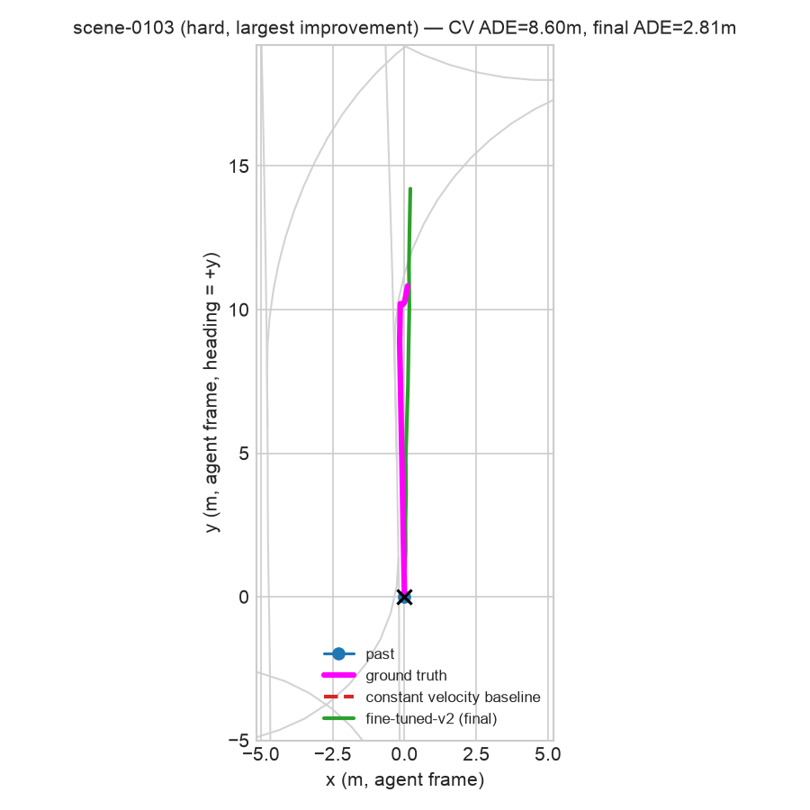
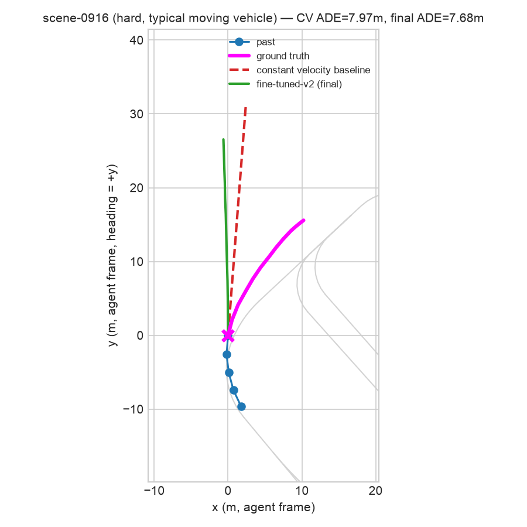
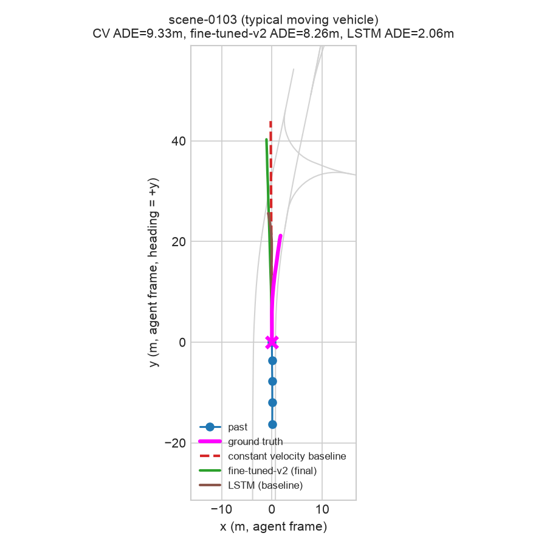

# TrajFlow

[](https://github.com/nickmelamed/traj_flow/actions/workflows/ci.yml)
[](LICENSE)

A trajectory prediction pipeline for autonomous vehicles, built on nuScenes
**mini**, combining three things in one project:

1. **Classical ML baselines.** Constant-velocity, constant-acceleration and
   XGBoost models.
2. **Two deep learning architectures, and ablations that isolate why they
   differ.** The first is a compact (108k-parameter) trajectory transformer,
   pretrained on "easy" driving scenes and fine-tuned on "hard" ones (dense
   traffic or intersections). The second is a compact (41k-parameter) LSTM
   encoder-decoder trained on the full dataset as an architecture comparison
   point. A hybrid with an attention encoder and an autoregressive decoder
   isolates decoding style as the driver of the LSTM's edge. Finally, the LSTM
   goes through the transformer's own pretrain, fine-tune and HITL lineage to
   check whether it shares the transformer's overfitting fragility. It does
   not.
3. **A human-in-the-loop (HITL) active learning loop.** The transformer's most
   uncertain predictions are flagged, then reviewed and corrected by a human
   in a Streamlit app and fed into a second fine-tuning round. A
   no-corrections control checks that the corrections themselves, not just
   extra training, are what helps.

This is a portfolio project for autonomy / planning & prediction engineering
roles. It prioritizes an honestly-measured, end-to-end pipeline over a
state-of-the-art model. Every result below is reported as measured,
including the ones where a "smarter" model loses to a one-line baseline.

## Setup

TrajFlow is an installable package (`src/trajflow/`, PEP 621
`pyproject.toml`). Clone it, create a virtualenv, and install it editable:

```bash
python3.11 -m venv traj
source traj/bin/activate
pip install -e .
```

That single `pip install -e .` installs every pinned dependency (torch,
nuscenes-devkit, xgboost, streamlit and others, listed in `pyproject.toml`)
and registers a `trajflow-*` console command for each pipeline stage below,
so no script paths or `PYTHONPATH` changes are needed.

On macOS, XGBoost additionally requires the OpenMP runtime:

```bash
brew install libomp
```

nuScenes mini requires a free account and a license click-through that
can't be scripted. `trajflow-download` tells you what to download and where
to put it.

### Development (tests, CI)

`tests/` is a `pytest` suite for logic that is easy to get subtly wrong and
hard to spot from metrics alone. It covers the minADE, minFDE and miss-rate
math, the constant-velocity and constant-acceleration kinematics, the
metrics-table read, replace and sanitize logic, the HITL corrections merge,
the feature and dataset construction, the loss, and the seed-variance
training-loop helper. Property-based tests (Hypothesis) check invariants of
the metrics and baselines. The tests use small synthetic data, so they need no
download, and [CI](.github/workflows/ci.yml) runs them on every push and pull
request.

```bash
pip install -e '.[dev]'
pytest tests/ -v
```

## Pipeline / how to reproduce

Every stage is a `trajflow-*` console command (installed by `pip install
-e .` above), run in order from the repo root:

```bash
trajflow-download                 # check/extract nuScenes mini + map expansion
trajflow-preprocess                # feature engineering, easy/hard split, train/val/test parquet
trajflow-baseline-cv               # constant-velocity baseline
trajflow-baseline-ca               # constant-acceleration baseline
trajflow-baseline-xgb              # XGBoost baseline
trajflow-pretrain                  # pretrain transformer on "easy" scenes
trajflow-finetune                  # fine-tune on "hard" scenes -> fine-tuned-v1
trajflow-flag-uncertain            # flag top ~10% most uncertain hard-train examples
trajflow-review-app                # human review + correction (interactive, Streamlit)
trajflow-finetune-round2           # fine-tune round 2 on HITL-corrected data -> fine-tuned-v2
trajflow-finetune-round2 --ablation-no-corrections  # control: same recipe, WITHOUT the corrections -> fine-tuned-v2-control
trajflow-train-lstm                # train the LSTM comparison architecture (full train split)
trajflow-train-transformer-full    # controlled experiment: transformer, same full-split training as the LSTM
trajflow-train-transformer-ar-full # ablation: attention encoder + autoregressive decoder, isolates decoder style
trajflow-lstm-pretrain             # LSTM through the transformer's own pretrain(easy)/fine-tune(hard)/HITL lineage...
trajflow-lstm-finetune              # ...fine-tune round 1...
trajflow-lstm-finetune-round2       # ...fine-tune round 2 (same corrections file as the transformer)
trajflow-scene-overlay             # generate the figures below
trajflow-moving-subset-analysis    # log every model's performance on genuinely moving vehicles, with bootstrap CIs
trajflow-seed-variance             # optional, slow (~10 min): re-trains every lineage across 3 seeds, logs mean +/- std
trajflow-finetune-regularization-sweep  # optional, ~1 min: weight-decay/dropout sweep on fine-tune round 1
trajflow-dashboard                 # interactive results dashboard (see below)
```

Every script appends to [`results/metrics_comparison.md`](results/metrics_comparison.md)
as it runs, so that file is the single source of truth for every metric in
this README.

For a one-command run, [`scripts/run_pipeline.sh`](scripts/run_pipeline.sh) runs
every non-interactive stage above in order and pauses right before the HITL
review step. Run it again with `--resume-after-hitl` after completing a
review pass to fine-tune round 2 and regenerate the figures.

```bash
./scripts/run_pipeline.sh
# ... complete a review pass in the app it points you to ...
./scripts/run_pipeline.sh --resume-after-hitl
```

Data, checkpoints, and results all live at the repo root next to `src/`
(`data/`, `checkpoints/`, `artifacts/`, `corrections/`, `results/`) rather
than inside the package, so they persist across reinstalls.
`src/trajflow/paths.py` defines the layout.

### Results dashboard

`trajflow-dashboard` is a read-only companion to the HITL review app, with no
correction controls:

- The Metrics tab filters `results/metrics_comparison.md` by eval split /
  difficulty and shows a bar chart per metric and the full sortable table
  with each row's methodology notes.
- The Scene Browser tab lets you pick any test example (with an easy/hard
  filter and a "moving vehicles only" filter, see below) and see history,
  ground truth, and *every* registered model's prediction overlaid on the
  map, with a per-example error table underneath. All 13 registered models
  are listed in [`viz/model_registry.py`](src/trajflow/viz/model_registry.py).
  They are the classical baselines, the transformer's pretrained,
  fine-tuned-v1, fine-tuned-v2 and fine-tuned-v2-control lineage, the
  full-split and autoregressive-decoder transformer ablations, and the LSTM's
  own baseline, pretrained, fine-tuned-v1 and fine-tuned-v2 lineage. Adding a
  model to the registry is the only change needed for it to appear here.
- The Per-Scene tab breaks any registered model's error out by
  individual scene (all 10, colored by train/val/test), not just the
  aggregated single-split numbers elsewhere. See "Seed variance" in Results
  for why scene-to-scene variance matters this much at this data size.

## Data

[nuScenes mini](https://www.nuscenes.org/) has 10 scenes (404 samples, 4
maps). For each vehicle instance and sample, `src/trajflow/data/preprocess.py`
extracts 2s of past and 6s of future agent-centric trajectory via the devkit's
`PredictHelper`, engineers kinematic and nearest-neighbor features, and
classifies each example as **easy** or **hard** based on neighbor density
and intersection proximity. The thresholds were tuned on this dataset, and
`preprocess.py` explains why the radii used in the literature didn't
transfer. Of 9,648 candidate examples, 4,715 have a full 6s future and are
kept:

| split | scenes | rows | easy | hard |
|---|---|---|---|---|
| train | 6 | 2,388 | 1,150 | 1,238 |
| val | 2 | 701 | 273 | 428 |
| test | 2 (official `mini_val`, held out untouched) | 1,626 | 747 | 879 |

Splits are scene-level. No scene's samples appear in more than one split.
Full schema in [`data/SCHEMA.md`](data/SCHEMA.md).

One dataset characteristic explains much of what follows. The median vehicle
in this data moves **0.16m** over the 6s prediction horizon, and over 90% of
examples are effectively parked or stationary cars. A "predict no movement"
baseline is therefore correct most of the time. That is what the
constant-velocity baseline does, so it is a strong baseline and not a
strawman.

## Methodology

**Phase 2, classical baselines.** Constant velocity extrapolates the
final observed velocity linearly. Constant acceleration extends this with
an acceleration vector estimated from a double finite-difference of the
two most recent past positions, then extrapolates `pos(t) = v*t +
0.5*a*t^2`. XGBoost (`MultiOutputRegressor` over `XGBRegressor`) predicts the 24-dim
flattened future waypoint vector from engineered features, trained on the
full train split.

**An LSTM comparison architecture** (`src/trajflow/models/lstm.py`). An LSTM
encodes 2s of past motion, fused with the same context vector the
transformer uses, and decodes K=6 candidate futures autoregressively. Each
`LSTMCell` step predicts one future position delta and feeds it back in as the
next input, in contrast to the transformer's parallel attention-based
decoding. The LSTM is trained in one run on the **full** train split (easy and
hard), unlike the transformer's pretrain, fine-tune and HITL lineage below,
so it is a standalone architecture comparison and not part of that pipeline.
It uses the same `TrajectoryDataset` and the same min-of-K plus cross-entropy
loss as the transformer, so data representation and loss are not confounded.
Training regime (full-split single run versus pretrain and fine-tune) is a
separate confound. `src/trajflow/models/train_transformer_full.py` addresses
it by training the pretrained and fine-tuned lineage's architecture the
LSTM's way. See Results.

**Isolating encoder vs. decoder** (`src/trajflow/models/transformer_ar.py` +
`train_transformer_ar_full.py`). The full-split controlled comparison
above still bundles two architectural differences into "the LSTM wins".
One is a recurrent encoder (LSTM) versus an attention encoder (transformer).
The other is an autoregressive decoder (one step conditions on the last)
versus a parallel one (all T future steps in a single forward pass). This model
holds the encoder fixed at TrajectoryTransformer's exact self-attention
encoder and swaps in an autoregressive `LSTMCell` decoder structurally
identical to the one in `models/lstm.py`. It is trained the same way as the
other two (full split, one pass), so all three isolate the two factors
cleanly:

  | | parallel decoder | autoregressive decoder |
  |---|---|---|
  | **attention encoder** | Transformer (full-split) | Transformer-AR (full-split) |
  | **LSTM encoder** | *(not built, not a natural combination)* | LSTM (baseline) |

See Results for which factor actually explains the gap.

**LSTM through the transformer's own lineage** (`train_lstm_pretrain.py` +
`finetune_lstm.py` + `finetune_lstm_round2.py`): mirrors Phases 3/4/6
below exactly (same epochs/LR/loss/model-selection criterion, same
corrections file for round 2) but for `LSTMTrajectoryModel` instead of
`TrajectoryTransformer`. Does the LSTM show the same scene-specific
overfitting the transformer shows when fine-tuned on only 6 scenes, or is
that a transformer-specific weakness? See Results.

**Phase 3, pretrain.** A compact self-attention encoder over 2s of past
motion, fused with an MLP-encoded context vector (kinematics + 3-nearest-
neighbor features), decoded into K=6 candidate futures + mode
probabilities via a second self-attention block. Trained on the **easy**
split only with a min-of-K displacement + cross-entropy loss (standard
multi-hypothesis trajectory prediction loss). Model-selected by best
val-set minADE.

**Phase 4, fine-tune (round 1).** Continues from the pretrained
checkpoint, fine-tuned on the **hard** split with a lower LR and fewer
epochs, producing `fine-tuned-v1`.

**Phase 5, HITL flagging + review.** `src/trajflow/hitl/flag_uncertain.py` scores the
hard-scene **training** examples, not test. Flagging test examples would mean
training on corrected test labels and then evaluating on those same
instances, which would invalidate the before/after comparison. The score
combines transformer mode-endpoint spread with XGBoost and transformer
disagreement, and the top ~10% (124 of 1,238) are flagged for review. `src/trajflow/hitl/review_app.py` (Streamlit) shows each flagged
example's past, nearby lane geometry, ground truth, all 6 transformer
modes, and the XGBoost prediction. The reviewer accepts, corrects (via 3
adjustable key waypoints auto-smoothed into the full path, with a live
preview), or tags a failure mode.

**Phase 6, fine-tune (round 2).** The reviewed corrections are merged
into the hard training set (13 of 1,238 labels actually changed. Most
flagged examples were judged fine as-is) and fine-tuning continues from
`fine-tuned-v1`, producing `fine-tuned-v2`.

**Ablation control for Phase 6.** `fine-tuned-v2` differs from
`fine-tuned-v1` in two confounded ways: it has 13 corrected labels *and*
60 more epochs of fine-tuning. Running
`src/trajflow/models/finetune_round2.py --ablation-no-corrections` reruns the
identical round-2 recipe (same starting checkpoint, epochs, LR, seed) on the
**uncorrected** hard-train split, producing `fine-tuned-v2-control`. The runs
differ only in whether the 13 labels are corrected. Comparing it
against `fine-tuned-v2` isolates whether the corrections themselves did
anything, versus just training longer. See Results.

**Can regularization fix the round-1 regression?**
(`src/trajflow/models/finetune_regularization_sweep.py`) Fine-tuning on 6
scenes was documented as overfitting-prone. This section tests whether the
problem is fixable. It sweeps weight decay (Adam,
`{0, 1e-4, 1e-3}`) x dropout (`{0.1 (finetune.py's actual value), 0.3}`),
otherwise reusing finetune.py's exact recipe (same 60 epochs, LR, seed,
starting checkpoint) via `evaluation/seed_variance.py`'s `train_loop`, so
every combination is directly comparable to the canonical
`fine-tuned-v1`. Early stopping is not swept separately, because the existing
best-val-checkpoint selection already has that effect (see the script's
docstring). See Results.

## Results

Headline comparison, evaluated on the untouched **test** split (all
difficulties):

| Model | minADE (m) | minFDE (m) | Miss Rate @2m |
|---|---|---|---|
| Constant Velocity | 0.511 | 1.101 | 0.077 |
| Constant Acceleration | 1.093 | 2.699 | 0.231 |
| XGBoost | 1.004 | 2.043 | 0.177 |
| Transformer, pretrained (easy-only) | 0.758 | 1.375 | 0.105 |
| Transformer, fine-tuned-v1 (hard) | 0.925 | 1.776 | 0.082 |
| Transformer, fine-tuned-v2 (post-HITL) | 0.905 | 1.776 | 0.076 |
| Transformer, fine-tuned-v2-control (no corrections, ablation) | 0.926 | 1.785 | 0.070 |
| **LSTM (baseline)** | **0.267** | **0.521** | **0.051** |

Full table with val-split rows and easy/hard breakdowns:
[`results/metrics_comparison.md`](results/metrics_comparison.md).

**The LSTM is the best model on every metric by a wide margin**, with a
caveat about what is being compared (see below). First, the other results:

- Constant acceleration substantially underperforms constant velocity
  (minADE 1.093 vs 0.511), despite being the more sophisticated physics
  model. Acceleration estimated from a double finite-difference of noisy
  position data is itself noisy, and the `t^2` term in constant-acceleration
  kinematics amplifies that noise over the 6s horizon. A small spurious
  acceleration estimate gives a >100m overshoot by t=6s for a near-stationary
  vehicle. This is a known weakness of naive higher-order extrapolation, not a
  bug (see `src/trajflow/models/baseline_ca.py`).
- XGBoost is the weakest learned model, for two reasons. An early version used
  a non-rotation-invariant absolute-heading feature that let the tree model
  overfit to specific scenes' road orientations, and removing it cut minADE
  from 1.656 to 1.004. Tree regressors also can't extrapolate past the range
  of displacements seen in training, so they systematically underestimate
  faster-moving agents.
- The transformer beats XGBoost even before fine-tuning, and gets within
  reach of constant velocity.
- Fine-tuning round 1 (hard scenes) made test performance worse relative to
  the pretrained checkpoint (minADE 0.758 → 0.925), even though it improved
  the validation metric used for model selection. With only 6 training
  scenes total, this reads as scene-specific overfitting and not a capability
  gain. It is a known risk of fine-tuning on very little data. It is not a
  one-seed fluke. The 3-seed variance study below shows fine-tuning
  regressing test/all minADE relative to pretrained in all 3 seeds tested (by
  +0.14 to +0.21 minADE each time). See "Seed variance."
- HITL round 2 recovered a modest slice of that regression (minADE 0.925 →
  0.905 on test/all). The ablation control supports this.
  `fine-tuned-v2-control` reruns the identical round-2 recipe (same 60 epochs,
  same starting checkpoint) on the *uncorrected* hard-train split and gets
  minADE **0.926**, indistinguishable from (very slightly worse than)
  fine-tuned-v1. More fine-tuning epochs alone didn't help, and the same
  epochs plus the 13 corrected labels did. The effect is small (13 of 1,238
  labels, ~1%) and the seed-variance study below shows it isn't consistent
  across seeds (2 of 3 improve, 1 is a wash). "Small but real" is the right
  summary, not "proven."

The LSTM comparison needed a control, and the result mostly held up. The LSTM
is trained differently from the transformer. It gets one training run on the
*full* train split, while the transformer goes through
pretrain-on-easy → fine-tune-on-hard → fine-tune-again-on-HITL-corrections.
Architecture and training regime are therefore confounded, so
`src/trajflow/models/train_transformer_full.py` trains the same
`TrajectoryTransformer` architecture the way the LSTM is trained (full train
split, one pass, identical loss, epochs and batch size) to separate them:

| Model | minADE (m), test/all | minADE (m), moving vehicles only |
|---|---|---|
| Transformer, pretrained (fragmented pipeline) | 0.758 | 5.791 |
| **Transformer, full-split (controlled)** | **0.750** | **4.477** |
| LSTM (baseline) | 0.267 | 2.738 |

Training regime mattered less than I expected. Giving the transformer the
same full-split training as the LSTM barely moved the aggregate number
(0.758 → 0.750) and only partly closed the moving-vehicle gap (5.791 → 4.477,
still nearly double the LSTM's 2.738). Architecture accounts for most of the
rest. The LSTM's recurrent, autoregressive decoder, where each step conditions
on the last, seems to have a real edge over the transformer's parallel
attention-based decoding on this task, independent of how the data is split
across training stages. The finding is narrow and rests on one dataset, but it
is not an artifact of an unfair comparison. The control is logged as its own
model (`Transformer (full-split)`) in
[`results/metrics_comparison.md`](results/metrics_comparison.md) so the
before/after can be checked.

### Isolating encoder vs. decoder

"Architecture" in the paragraph above still bundles two differences:
encoder type (attention vs. recurrent) and decoder style (parallel vs.
autoregressive). `Transformer-AR` (see Methodology) holds the encoder
fixed at the transformer's own self-attention encoder and swaps in an
autoregressive decoder structurally identical to the LSTM's:

| Model | encoder | decoder | params | minADE (m), test/all | minADE (m), moving only |
|---|---|---|---|---|---|
| Transformer (full-split) | attention | parallel | 108,249 | 0.750 | 4.477 |
| **Transformer-AR (full-split)** | attention | **autoregressive** | 90,755 | **0.287** | **3.529** |
| LSTM (baseline) | LSTM | autoregressive | 40,963 | 0.267 | 2.738 |

Swapping only the decoder, with the same encoder and data, took test/all
minADE from 0.750 to 0.287, closing 96% of the gap to the LSTM's 0.267. It did
so with *fewer* parameters than the original transformer (90,755 versus
108,249, since the autoregressive decoder head is smaller than the parallel
one), so extra capacity does not explain it. **Decoder style is the dominant
factor.** On the moving-vehicle-only numbers the picture is more nuanced.
Transformer-AR (3.529) closes about 55% of the gap between the full-split
transformer (4.477) and the LSTM (2.738). That is most of the gap but not all
of it, so the LSTM's recurrent *encoder* may contribute a little on moving
vehicles, though much less than the decoder does in aggregate. This was also
the most seed-stable result in the project (see "Seed variance" below), which
suggests the effect is real and not noise.

### Does the LSTM overfit the same way?

Fine-tuning the transformer on 6 hard-training scenes regressed test
performance (see above). Does the LSTM show the same fragility when put
through the identical pretrain(easy)/fine-tune(hard)/fine-tune(HITL)
lineage (see Methodology), or is that a transformer-specific weakness?

| Model | minADE (m), test/all | minADE (m), test/hard | minADE (m), moving only |
|---|---|---|---|
| Transformer, pretrained (easy-only) | 0.758 | 0.798 | 5.791 |
| Transformer, fine-tuned-v1 (hard) | 0.925 (**regressed**) | 0.896 (**regressed**) | 5.493 |
| LSTM, pretrained (easy-only) | 0.294 | 0.337 | 3.398 |
| LSTM, fine-tuned-v1 (hard) | 0.278 (**improved**) | 0.307 (**improved**) | 3.163 (**improved**) |
| LSTM, fine-tuned-v2 (post-HITL) | 0.279 (flat) | 0.305 (flat/slight improvement) | 3.219 (slight regression) |

**No, the LSTM does not share the transformer's overfitting fragility.**
Fine-tuning *improves* the LSTM on every headline metric, while the
transformer regresses on the same 6 scenes with the same recipe. This doesn't
fully explain *why*. A recurrent decoder may simply have a more favorable loss
landscape for a small, low-diversity fine-tuning set, but testing that would
need its own ablation. It does rule out "any model fine-tuned on 6 scenes will
overfit like this" as a general claim, so the effect is at least partly
architecture-dependent. HITL round 2 is close to a wash for the LSTM (there's
little regression left to recover), consistent with the ablation-control
finding that the corrections' effect is small and not a universal fix.

### Can regularization fix the fine-tuning regression?

| weight_decay | dropout | val minADE (model-selection) | test/all minADE | vs. canonical (wd=0, dropout=0.1) |
|---|---|---|---|---|
| 0 | 0.1 (canonical) | 2.164 | 0.925 | n/a |
| 1e-4 | 0.1 | 2.178 | 0.862 | −0.063 |
| 1e-3 | 0.1 | 2.148 | **0.813** | **−0.112 (67% of the regression recovered)** |
| any | 0.3 | 2.297 | 0.758 | *(see note)* |

Two different things happen here, and only one of them is real
regularization:

- Weight decay (at the canonical dropout=0.1) helps. `wd=1e-3` cuts the
  round-1 regression from +0.167 minADE (0.758 → 0.925) to +0.055
  (0.758 → 0.813), a 67% reduction, without changing anything else about the
  recipe. It doesn't fully close the gap to the pretrained checkpoint, but it
  is a usable mitigation.
- Dropout=0.3 does not regularize, because fine-tuning never effectively
  happens. All three dropout=0.3 rows land at exactly 0.758, identical to the
  pretrained checkpoint's own test/all minADE and its own val minADE (2.297,
  matching the logged "Transformer (pretrained, easy-only)" row). The higher
  dropout made 60 epochs of fine-tuning too noisy to beat the pre-fine-tuning
  val score, so best-checkpoint selection returned the starting weights
  unchanged, as designed. A suspiciously flat row across a hyperparameter
  sweep is a sign of this and not a sign the setting works.

Full 6-combination sweep (all weight_decay x dropout pairs, plus test/hard)
logged at phase 10 in
[`results/metrics_comparison.md`](results/metrics_comparison.md).

### The moving-vehicle subset

Constant velocity's aggregate win comes almost entirely from the dataset's
dominant near-stationary majority (median displacement 0.16m, see above).
Restricted to the 63/1,626 test examples where the vehicle moves more than 5m
over the 6s horizon, which are the ones that matter for planning, several
learned models beat constant velocity and the LSTM's lead widens:

| Model | minADE (m), moving vehicles only | minFDE (m) | Miss Rate @2m |
|---|---|---|---|
| Constant Velocity | 6.604 | 15.591 | 0.952 |
| Constant Acceleration | 6.853 | 16.744 | 0.937 |
| XGBoost | 5.390 | 13.174 | 0.984 |
| Transformer, pretrained | 5.791 | 13.383 | 0.921 |
| Transformer, fine-tuned-v1 | 5.493 | 12.898 | 0.889 |
| Transformer, fine-tuned-v2 | 5.434 | 12.870 | 0.873 |
| Transformer, fine-tuned-v2-control (no corrections, ablation) | 5.368 | 12.653 | 0.889 |
| Transformer, full-split (controlled) | 4.477 | 10.456 | 0.873 |
| Transformer-AR, full-split (autoregressive decoder ablation) | 3.529 | 7.893 | 0.889 |
| LSTM, pretrained (easy-only) | 3.398 | 7.459 | 0.873 |
| LSTM, fine-tuned-v1 (hard) | 3.163 | 6.898 | 0.810 |
| LSTM, fine-tuned-v2 (post-HITL) | 3.219 | 6.926 | 0.778 |
| **LSTM (baseline)** | **2.738** | **6.391** | 0.921 |

Ranked by minADE, the LSTM's lead over the strongest non-LSTM, non-AR model
(XGBoost, 5.390) is larger on this subset than in aggregate, so it is not
winning just by being correct on parked cars. Every learned model except
constant acceleration beats constant velocity here. The aggregate metric is
accurate but easy to over-read. "Constant velocity wins" means it wins on
parked cars, and several learned models predict better once a vehicle is
actually moving. Within the LSTM lineage the order on this subset is baseline
2.738 < fine-tuned-v1 3.163 < fine-tuned-v2 3.219 < pretrained 3.398. The
full-split LSTM baseline, trained on more data in one pass, beats every stage
of the fragmented LSTM lineage on this 63-example subset, even though
fine-tuning helped that lineage relative to its own pretrained stage. Training
on more data in one pass and fine-tuning within a lineage are separate
findings.

These rows are logged in
[`results/metrics_comparison.md`](results/metrics_comparison.md)
(phase 7, difficulty=`moving (>5m displacement)`) and generated by
`src/trajflow/evaluation/moving_subset_analysis.py` for every registered model.

The control row needs a note. On this 63-example subset,
`fine-tuned-v2-control` (no corrections) edges out `fine-tuned-v2` (5.368
vs 5.434), the opposite direction from test/all and test/hard, where
`fine-tuned-v2` clearly wins (see above). This is the case "Statistical
caveats" below covers. At n=63, small differences between the fine-tuned
models should not be over-read, although the much larger gap to constant
velocity is robust.

### Statistical caveats (bootstrap CIs on the 63-example subset)

63 examples is small enough that point estimates alone invite over-reading.
`moving_subset_analysis.py` also computes a 95% bootstrap CI (2,000
resamples) for every model's minADE. It also runs a paired bootstrap that
reuses the same resample indices across models, since it is the same 63
examples each time, and reports how often each model beats Constant Velocity
across those resamples. Both are logged in each row's Notes column in
[`results/metrics_comparison.md`](results/metrics_comparison.md).

| Model | minADE (m) | 95% CI (m) | beats CV in |
|---|---|---|---|
| Constant Velocity | 6.604 | [5.44, 7.88] | n/a |
| Constant Acceleration | 6.853 | [5.58, 8.26] | 28.8% of resamples |
| XGBoost | 5.390 | [4.59, 6.24] | 100.0% of resamples |
| Transformer, pretrained | 5.791 | [4.88, 6.73] | 97.8% of resamples |
| Transformer, fine-tuned-v1 | 5.493 | [4.63, 6.38] | 100.0% of resamples |
| Transformer, fine-tuned-v2 | 5.434 | [4.62, 6.32] | 100.0% of resamples |
| Transformer, fine-tuned-v2-control | 5.368 | [4.54, 6.27] | 100.0% of resamples |
| Transformer, full-split | 4.477 | [3.69, 5.28] | 100.0% of resamples |
| Transformer-AR, full-split | 3.529 | [2.99, 4.09] | 100.0% of resamples |
| LSTM, pretrained | 3.398 | [2.82, 4.00] | 100.0% of resamples |
| LSTM, fine-tuned-v1 | 3.163 | [2.58, 3.79] | 100.0% of resamples |
| LSTM, fine-tuned-v2 | 3.219 | [2.65, 3.85] | 100.0% of resamples |
| **LSTM (baseline)** | **2.738** | **[2.32, 3.22]** | **100.0% of resamples** |

Two conclusions live in this table, and they should not be confused:

- **That learned models beat constant velocity on moving vehicles is
  robust.** Every model except Constant Acceleration beats CV in at least
  97.8% of paired bootstrap resamples (ten of twelve beat it in 100%), and
  the CIs barely overlap CV's for the transformer, LSTM and XGBoost rows. The
  moving-vehicle subset section above rests on this claim.
- Ranking within a lineage does not hold up at this sample size. For example,
  the transformer's pretrained (5.791), fine-tuned-v1 (5.493), fine-tuned-v2
  (5.434) and fine-tuned-v2-control (5.368) rows have heavily overlapping 95%
  CIs, as do the LSTM lineage's four rows (2.738–3.398). Nothing here
  supports a claim like "fine-tuned-v2 is better than fine-tuned-v1 on moving
  vehicles". Only the much larger test/all and test/hard splits (879–1,626
  examples, where the CIs would be far tighter) are big enough for that kind
  of claim. That is why the HITL-effect and LSTM-overfitting arguments above
  rest on those splits and the ablation control, not on this table. One
  cross-family comparison does hold up at this sample size. Transformer-AR's
  CI [2.99, 4.09] sits clearly below the full-split transformer's [3.69, 5.28]
  and clearly above the LSTM's [2.32, 3.22], so the decoder-style effect from
  "Isolating encoder vs. decoder" above is large enough to survive n=63,
  unlike the smaller within-lineage effects.

### Seed variance

Every checkpoint above is a single `SEED=0` training run. Given how small
nuScenes mini's train split is (6 scenes), that raises the question of how
much of the story above is one seed's luck and how much is a property of the
method. `trajflow-seed-variance` (`src/trajflow/evaluation/seed_variance.py`)
re-runs every lineage across 3 seeds (0, 1, 2). The lineages are the
transformer's pretrain → fine-tune-v1 → fine-tune-v2, the LSTM baseline, the
full-split transformer, Transformer-AR, and the LSTM's own pretrain →
fine-tune-v1 → fine-tune-v2. The recipes are identical (same `EPOCHS`, `LR`
and `BATCH_SIZE` imported directly from each canonical script, same
corrections file) and only the seed differs. It does not touch any canonical
checkpoint. The models trained here are evaluated and then discarded, so
nothing above changes as a result of running it. Full per-model rows (mean ±
std, plus every individual seed's value in Notes) are logged at phase 8 in
[`results/metrics_comparison.md`](results/metrics_comparison.md).

| Model | test/all minADE, mean ± std (3 seeds) | test/hard minADE, mean ± std |
|---|---|---|
| Transformer, pretrained | 0.683 ± 0.064 | 0.737 ± 0.068 |
| Transformer, fine-tuned-v1 | 0.855 ± 0.049 | 0.835 ± 0.055 |
| Transformer, fine-tuned-v2 | 0.776 ± 0.041 | 0.761 ± 0.063 |
| Transformer, full-split | 0.709 ± 0.052 | 0.788 ± 0.090 |
| **Transformer-AR, full-split** | **0.292 ± 0.005** | **0.338 ± 0.008** |
| LSTM, pretrained (easy-only) | 0.571 ± 0.281 | 0.849 ± 0.518 |
| LSTM, fine-tuned-v1 (hard) | 0.282 ± 0.017 | 0.317 ± 0.030 |
| LSTM, fine-tuned-v2 (post-HITL) | 0.277 ± 0.009 | 0.312 ± 0.017 |
| LSTM (baseline) | 0.263 ± 0.014 | 0.302 ± 0.023 |

What holds up across seeds, and what doesn't:

- The LSTM's win over every transformer variant is not a one-seed fluke. Its
  worst seed (test/all minADE 0.278) still beats every parallel-decoder
  transformer variant's *best* seed (0.602, pretrained/seed2) by more than 2×.
- Transformer-AR is the most seed-stable result in the project. Its std is
  0.005 on test/all, about an order of magnitude tighter than every other
  trained model here (the next tightest is LSTM fine-tuned-v2 at 0.009, and
  most others are 0.04–0.09). It lands at ~0.29 in all 3 seeds, well away from
  the parallel-decoder transformer's ~0.68–0.86 range. That supports decoder
  style being the dominant factor (see "Isolating encoder vs. decoder" above)
  and not a lucky seed-0 run.
- The LSTM's easy-only pretrain stage is seed-unstable, unlike Transformer-AR.
  The individual seeds are 0.294, 0.463, 0.956 (test/all) and 0.337, 0.651,
  1.558 (test/hard), nearly a 5x spread on the hard split. The canonical SEED=0
  checkpoint happened to land at the good end of that range. Fine-tuning
  consistently rescues it. Once continued onto the hard split, variance drops
  from ±0.281 to ±0.017 (test/all) and the mean improves from 0.571 to 0.282.
  For the LSTM lineage, fine-tuning is stabilizing as well as harmless (see
  "Does the LSTM overfit the same way?" above), in sharp contrast to the
  transformer lineage, where fine-tuning consistently *hurts* (next bullet).
  Why the LSTM's easy-only pretrain is this unstable isn't fully explained
  here. One guess is that autoregressive decoding on a small, low-diversity
  1,150-row split gives the recurrent decoder more ways to converge to a poor
  local optimum than the parallel decoder has. Confirming that would need its
  own ablation.
- Fine-tuning round 1 regresses test/all minADE relative to pretrained in all
  3 seeds for the transformer (+0.165, +0.140, +0.210 minADE, never an
  improvement). That is stronger evidence for scene-specific overfitting on 6
  training scenes than the single canonical run alone. The pattern is specific
  to the transformer, and the LSTM lineage goes the other way (previous
  bullet).
- HITL round 2's improvement over fine-tuned-v1 is directionally consistent
  but not uniform for the transformer. 2 of 3 seeds improve (seed0: 0.923 →
  0.731, seed2: 0.812 → 0.766) and one is roughly flat (seed1: 0.829 → 0.830).
  The ablation control above points the same way, since more epochs alone
  don't help and the control gets *worse*, not better, than fine-tuned-v1. So
  the corrections plausibly help on average. "Recovers a modest slice of the
  regression" is a directional claim backed by 2 of 3 seeds and one ablation,
  not a seed-independent guarantee. For the LSTM lineage, round 2 is close to a
  wash either way (0.282 → 0.277 mean), consistent with little regression being
  left to recover once fine-tuning has already helped.
- Seed 0 here doesn't exactly reproduce the canonical checkpoints' numbers
  (fine-tuned-v1 test/all is 0.923 here and 0.925 canonical), a discrepancy
  under 1% despite identical code, seed and data. The most likely cause is CPU
  floating-point non-associativity, since multi-threaded matmul and attention
  ops are not bit-identical run to run even at a fixed seed. Forcing
  single-threaded execution measurably changes trained results (see
  `seed_variance.py`'s module docstring). This supports the Limitations point
  that single-run results should be read as plausible, not precise.

### Figures

**Easy scene, typical moving vehicle.** Selected by median *relative*
performance among moving vehicles, not median absolute error (see the script
comments for why). Fine-tuned-v2 tracks the curve into the ground truth
noticeably better than constant velocity's straight-line overshoot (ADE 8.06m
vs 9.00m).



**Hard scene, largest improvement over the baseline.** This vehicle had zero
recent velocity (just pulling away from a stop). Constant velocity predicts it
stays exactly stationary for the full 6s. It actually accelerates forward ~11m.
The fine-tuned model anticipates the acceleration (ADE 2.81m vs 8.60m). This is
the kind of case fine-tuning is *supposed* to help with, and here it does.



**Hard scene, typical moving vehicle.** A representative case from the
moving-vehicle subset. The vehicle curves through a turn, constant velocity
overshoots the curve's sharpness, and the fine-tuned model tracks it slightly
better (ADE 7.68m vs 7.97m). It is a close, unremarkable case, which is the
point. On moving vehicles the two models are much closer than the aggregate
table suggests, with fine-tuned-v2 slightly ahead on average.



**Typical moving vehicle, with the LSTM.** A median moving-vehicle example
(see the caveat above about the training-regime confound). Constant velocity
and fine-tuned-v2 both roughly extrapolate a straight line, overshooting the
vehicle's actual turn. The LSTM tracks the curve closely (ADE 2.06m vs 9.33m
and 8.26m).



## Human-in-the-loop review, in practice

124 examples were reviewed: 111 accepted as-is, 13 corrected. Failure-mode
tags: 112 none, 9 sensor noise, 3 occlusion (no aggressive-merge or
map-ambiguity tags landed in this pass). The low correction rate is
informative. Most flagged examples had good ground truth. The model was
uncertain because the task was hard (a new instance with no observed history,
an ambiguous intersection turn), and the labels were fine. Telling these cases
apart is what the review step is for. A model disagreeing with itself does not
mean the data is broken.

## Limitations & what I'd do with more compute/data

- nuScenes mini is tiny (10 scenes). Train, val and test come from disjoint
  scenes, so scene-to-scene variance dominates. The constant-velocity
  baseline's own minADE is 2.1702 on train, 2.4861 on val and 0.5109 on test
  (phase 2 in [`results/metrics_comparison.md`](results/metrics_comparison.md),
  and `baseline_cv.py` evaluates all three splits), purely because the scenes
  have very different typical vehicle speeds. Read any single-run result here
  as plausible, not precisely measured. The fix is more scenes and proper
  cross-validation. The seed-variance study (see "Seed variance" above) shows
  that even the same split can give meaningfully different results run to run.
- Scale-up path. `data/download.py` and `data/preprocess.py` both take a
  `--version` flag (for example `v1.0-trainval`). The devkit source shows that
  this pipeline's feature-extraction path (`PredictHelper`, `NuScenesMap`)
  never reads the `samples/` or `sweeps/` sensor-blob directories. It uses
  only JSON metadata and the 4 map PNGs already downloaded, which are shared
  across every nuScenes version. Scaling from mini's 10 scenes to trainval's
  850 (`nuscenes.utils.splits.train` and `val`, 700+150 scenes) should
  therefore need only nuScenes' "Metadata" download, not the ~350 GB of "File
  blobs". `data/download.py`'s module docstring has the instructions and
  caveats. This has not been tested against the real archive, because fetching
  it needs an account and license click-through that can't be automated.
  Preprocessing time should scale roughly linearly with scene count, so expect
  it to run noticeably longer than mini's few minutes at 850 scenes.
  `preprocess.py --max-scenes N` caps the total scene count (deterministically,
  not as a random subsample) for a pilot run before committing to all 850,
  for example `--max-scenes 100 --val-scenes-from-train 10`.
  `preprocess.py` also writes the version it was run with to
  `data/processed/VERSION`. The review app, the dashboard and the scene overlay
  read it through `paths.active_nuscenes_version()`, because tokens in
  processed rows exist only in the matching nuScenes index. Without the marker
  they fall back to `v1.0-mini`.
- The dataset is dominated by near-stationary vehicles, which is why constant
  velocity is such a strong baseline. A production system would want metrics
  stratified by genuinely moving agents (or a training and eval set
  rebalanced toward them), since that is where prediction quality matters for
  planning.
- Fine-tuning on 6 scenes overfits for the transformer. This is
  architecture-specific and partly fixable. The LSTM put through the identical
  fine-tuning recipe on the same 6 scenes does *not* regress (see "Does the
  LSTM overfit the same way?" in Results), so "small-data fine-tuning
  overfits" is not a safe general claim, at least at this effect size. For the
  transformer, a weight-decay sweep (`finetune_regularization_sweep.py`)
  recovered about two-thirds of the regression (see "Can regularization fix
  the fine-tuning regression?" in Results) without eliminating it. Next steps
  would be early stopping keyed to a larger, more representative validation
  set, or more training scenes. Early stopping by epoch count alone would not
  help, since the existing best-checkpoint selection already captures that
  effect (see the sweep script's docstring).
- The controlled LSTM-versus-transformer experiment (see Results) isolated
  training regime. The Transformer-AR ablation (see "Isolating encoder vs.
  decoder") isolated decoder style. Together they show that decoder style
  (autoregressive vs. parallel), and not encoder type (attention vs.
  recurrent) or training regime, explains most of the LSTM's advantage. Not
  isolated are each architecture's own hyperparameters (d_model, layer count,
  hidden size and so on), which were held fixed and never tuned for any of the
  three models. A fuller ablation would vary them to rule out one architecture
  simply getting a better parameter count for this data size, and would test
  why autoregressive decoding helps this much. My working guess is error
  accumulation in the loss signal during training and not only at inference,
  which this project does not test directly.
- The transformer only sees 3 nearest neighbors and no map-vector encoding.
  Map context is used for the easy/hard split and the HITL viewer, not as a
  model input. A production model would encode the full local lane graph (for
  example VectorNet or LaneGCN style) and not scalar nearest-neighbor
  features.
- HITL correction volume was small by construction (10% flag rate, 124
  examples, 13 real corrections). That is enough to demonstrate the full loop,
  not enough to expect a large before/after change. At production scale, this
  loop would run continuously over much larger flagged batches.
- Two infrastructure problems, both noted in code comments. One is a
  non-rotation-invariant feature leak (see the XGBoost note above). The other
  is a macOS OpenMP conflict between PyTorch and XGBoost that segfaults or
  deadlocks unless `KMP_DUPLICATE_LIB_OK` and `OMP_NUM_THREADS` are set before
  either library is imported.

## Repo layout

See [`docs/SPEC.md`](docs/SPEC.md) for the build spec, phase breakdown and
acceptance criteria. Design decisions and their reasons are in
[`docs/DECISIONS.md`](docs/DECISIONS.md).

```
pyproject.toml            dependencies + trajflow-* console-script entry points
scripts/run_pipeline.sh   one-command runner for the whole non-interactive pipeline
tests/                    pytest suite (pure-function logic, synthetic data, no dataset needed)
.github/workflows/       ci.yml runs tests/, agent-checks.yml runs style and hook checks
CLAUDE.md, .claude/       instructions, hooks, rules and repo skills for Claude Code
docs/                     SPEC.md (build spec) and DECISIONS.md (decision log)
scripts/agent/            the hook and style/number check scripts
LICENSE                   MIT (code only, nuScenes has its own license, see below)

src/trajflow/
  data/          download (mini + trainval-metadata-only scale-up) + preprocessing, schema doc
  models/        baselines (CV, CA, XGBoost); transformer, LSTM, and hybrid Transformer-AR
                 (attention encoder + autoregressive decoder) architectures; the transformer's AND
                 the LSTM's own pretrain/fine-tune/fine-tune-round-2 (+ HITL-ablation-control) lineages;
                 full-split controlled-comparison scripts; regularization sweep
  evaluation/    metrics (minADE/minFDE/MissRate), comparison-table logging,
                 moving-vehicle-subset analysis (+ bootstrap CIs), seed-variance study
  hitl/          uncertainty flagging + Streamlit review app
  viz/           model registry (shared prediction interface for all 13 registered models),
                 scene overlay figure generation, interactive results dashboard (Metrics /
                 Scene Browser / Per-Scene tabs)
  paths.py       single source of truth for every data/artifact directory below

data/            nuScenes data (gitignored) + processed/ parquet and VERSION marker (gitignored) + SCHEMA.md
checkpoints/     trained model weights (gitignored, regenerable)
artifacts/       HITL flagging output, e.g. flagged.parquet (gitignored)
corrections/     HITL reviewer output (gitignored, personal review data)
results/         metrics_comparison.md + figures/
```

## License

This repository's code is [MIT licensed](LICENSE). nuScenes mini itself is
not included here (see "Setup") and is subject to its own terms of use at
[nuscenes.org](https://www.nuscenes.org/terms-of-use).
